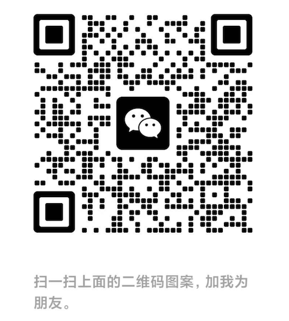

# My Wechat Bot

## Become friends with my digital identity

## Development
> Notice: the following tool should available in your computer
>   Redis
>   PM2
>   PNPM
>   Node.js v20

1. Create `.env` from `.env.example`, config `OPENAI_API_KEY`, `POSTGRES_URL` in `.env`
2. If database is not initialized, run `pnpm db` to init postgres db. (you can use local postgres or remote serverless postgres)
3. Install dependencies `pnpm install`
4. Run `pnpm dev`

## Build and Deploy to server

> Notice: the following tool should available in your server
>   Redis
>   PM2
>   PNPM
>   Node.js v20

0. If database is not initialized, run `pnpm db` in you local computer to init postgres db. (you can use local postgres or remote serverless postgres)
1. Run `pnpm build`, all assets are in the `dist` folder
2. Deploy `dist` to your server
    - Use `tools/deploy.sh`
    - You need to set env SSH_KEY, SRC, DIST
        - SRC: your `dist` folder path in your local computer
        - DIST: the dest endpoint:folder in your server. e.g. `username@xxx.xxx.xxx.xxx:/home/user/wechat-bot`
3. ssh to your server and run `pnpm install --production`
4. create `.env` from `.env.example`, config `OPENAI_API_KEY`, `POSTGRES_URL` in `.env`
5. create `pm2.config.json` from `pm2.config.json.example` 
6. `pm2 start pm2.config.json`
